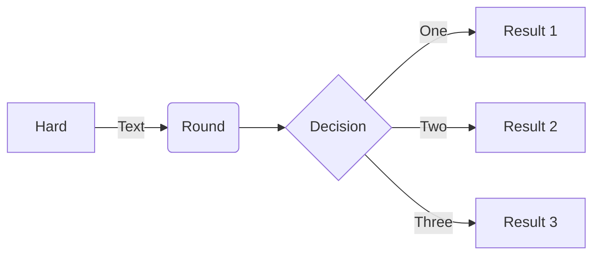

# note
## bandit/overthewire: 
Commande à retenir :
* `ls -la`
*  git status
*  git add .
*  git commit -m "nom des changement"
*  git push
*  git pull (recuperé)
*  IL : Instruction list de l'ordi : dépend du language du pc en lui même
*  Lexis : facilité la segmentation de texte : découper le texte en unités comme les phrases ou les mots.
L'analyse de fréquence : compter la fréquence des mots ou des phrases.
Le calcul de statistiques lexicales : analyser la richesse et la diversité du vocabulaire.
* sémantic : suite de règle qui determine si certaine phrase ont du sens.
* fichier contenant le code source (source code = programme écrit dans un langage de programmation de haut niveau) = source file

Test debut
== Vérification
