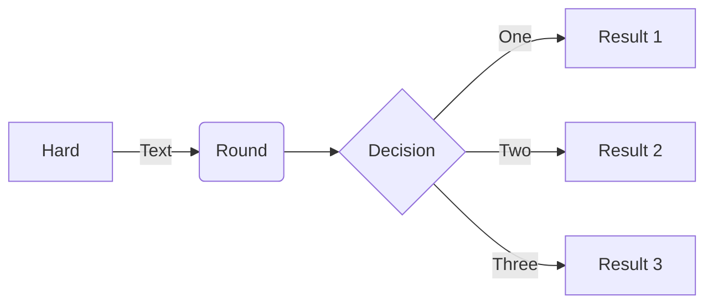

# note
## bandit/overthewire: 
Commande à retenir :
* `ls -la`
*  git status
*  git add .
*  git commit -m "nom des changement"
*  git push
*  git pull (recuperé)
  

```mermaid
flowchart LR

A[Hard] -->|Text| B(Round)
B --> C{Decision}
C -->|One| D[Result 1]
C -->|Two| E[Result 2]
C -->|Three| F[Result 3]
```
Test debut
== Vérification
