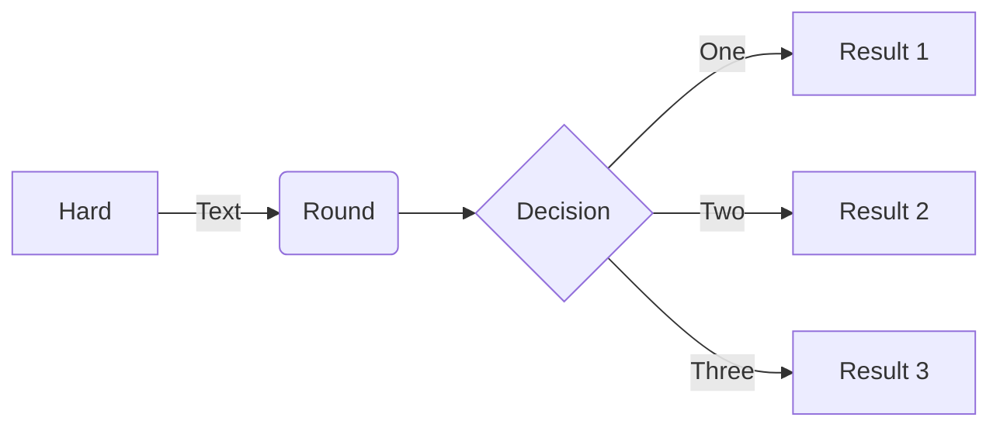

# note
## bandit/overthewire: 
Commande à retenir :
* `ls -la`
*  git status
*  git add .
*  git commit -m "nom des changement"
*  git push
*  git pull (recuperé)
*  IL : Instruction list de l'ordi : dépend du language du pc en lui même
*  Lexis : facilité la segmentation de texte : découper le texte en unités comme les phrases ou les mots.
L'analyse de fréquence : compter la fréquence des mots ou des phrases.
Le calcul de statistiques lexicales : analyser la richesse et la diversité du vocabulaire.
* sémantic : suite de règle qui determine si certaine phrase ont du sens.
* fichier contenant le code source (source code = programme écrit dans un langage de programmation de haut niveau) = source file
  le code source doit etre écrit sans aucune décoration comme des polices différentes, des couleurs, des images intégrées ou d'autres médias
### 4 Règles a respecté pour qu'un programme fonctionne :

* Synctactically : chaque language a ces règles et doivent être respecté.
* Sementically = programme qui doit avoir du sens sinon ne donnera pas le résultat voulu.
* alphabetically : programme doit etre ecris dans une langue reconnue.
* Lexically : ​chaque langage de programmation a son dictionnaire
#### Créateur du python
* Guido Van Rossum né en 1956 à Haarlem au Pays-bas 



Test debut
== Vérification

```tabulate
from tabulate import tabulate
tableau_types = [
    ["int", "Nombres entiers", "42, -5"],
    ["float", "Nombres décimaux", "3.14, -2.0"],
    ["str", "Chaînes de caractères", '"Python", "Hello"'],
    ["bool", "Valeurs logiques", "True, False"],
    ["list", "Liste ordonnée et modifiable", "[1, 2, 3], ['a', 'b']"],
    ["tuple", "Liste ordonnée mais immuable", "(1, 2, 3)"],
    ["set", "Ensemble sans doublons", "{1, 2, 3}"],
    ["dict", "Dictionnaire clé-valeur", '{"clé": "valeur"}'],
    ["complex", "Nombres complexes", "3 + 4j"],
    ["NoneType", "Absence de valeur", "None"],
    ["bytes", "Données binaires", 'b"data"'],
    ["range", "Séquence de nombres", "range(5)"]
]

# Affichage du tableau
print(tabulate(tableau_types, headers=["Type", "Description", "Exemple"], tablefmt="grid"))


