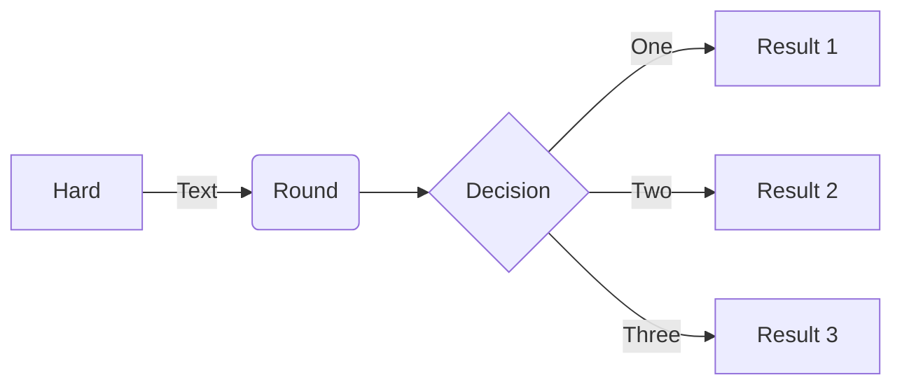

# note
## bandit/overthewire: 
Commande à retenir :
* `ls -la`
*  git status
*  git add .
*  git commit -m "nom des changement"
*  git push
*  git pull (recuperé)
*  IL : Instruction list de l'ordi : dépend du language du pc en lui même
*  Lexis : facilité la segmentation de texte : découper le texte en unités comme les phrases ou les mots.
L'analyse de fréquence : compter la fréquence des mots ou des phrases.
Le calcul de statistiques lexicales : analyser la richesse et la diversité du vocabulaire.
* sémantic : suite de règle qui determine si certaine phrase ont du sens.
* fichier contenant le code source (source code = programme écrit dans un langage de programmation de haut niveau) = source file
  le code source doit etre écrit sans aucune décoration comme des polices différentes, des couleurs, des images intégrées ou d'autres médias
### 4 Règles a respecté pour qu'un programme fonctionne :

* Synctactically : chaque language a ces règles et doivent être respecté.
* Sementically = programme qui doit avoir du sens sinon ne donnera pas le résultat voulu.
* alphabetically : programme doit etre ecris dans une langue reconnue.
* Lexically : ​chaque langage de programmation a son dictionnaire
#### Créateur du python
* Guido Van Rossum né en 1956 à Haarlem au Pays-bas
* PSF: Python Software Foundation
### Cpython :
* Cpython : Grâce à lui, Python peut être facilement porté et migré vers toutes les plateformes avec la possibilité de compiler et d'exécuter des programmes en langage « C » (pratiquement toutes les plateformes ont cette fonctionnalité, ce qui ouvre de nombreuses possibilités d'extension pour Python)

  * Compilation en C 

    La compilation en C permet donc de créer des programmes rapides et efficaces, souvent utilisés pour des systèmes d'exploitation, des logiciels embarqués, et des applications nécessitant une grande optimisation des ressources.
    Le langage C est un langage de programmation généraliste et bas niveau, développé dans les années 1970 pour créer des systèmes d'exploitation(UNIX)
  * UNIX
      Unix est un système d'exploitation multitâche et multi-utilisateur, développé dans les années 1970 au sein des laboratoires Bell d'AT&T. Conçu pour être portable, flexible et stable, Unix est à l'origine d'une famille de systèmes d'exploitation, dont Linux et macOS sont des descendants.  
### Jython
* J = Java 
* Jython peut communiquer plus efficacement avec l'infrastructure Java existante. C'est pourquoi certains projets le trouvent utile et nécessaire
* L'implémentation actuelle de Jython suit les normes Python 2. Il n'existe pas de Jython conforme à Python 3, jusqu'à présent.
### Pypy
* PyPy est plutôt un outil pour les personnes qui développent Python que pour le reste des utilisateurs , PyPy est compatible avec le langage Python 3.
  * Représente un environnement Python écrit dans un langage de type Python appelé RPython (Restricted Python). Il s'agit en fait d'un sous-ensemble de Python.
### Module 2
* add-on python = Module
  * ##### 4 fonction du python
  * 1 : Check si le nom utilisé est legal dans leur base de donnée
  * 2 : Python vérifie si les exigences de la fonction concernant le nombre d'arguments vous permettent d'invoquer la fonction de cette manière
    (si une fonction spécifique exige exactement deux arguments, toute invocation ne fournissant qu'un seul argument sera considérée comme erronée et annulera l'exécution du code)
  * 3 : Python quitte votre code un instant et saute dans la fonction que vous souhaitez invoquer ; bien sûr, il prend également votre/vos argument(s) et le/les passe/nt à la fonction
  * 4 : Exécute son code , provoque l’effet souhaité (le cas échéant), évalue le(s) résultat(s) souhaité(s) (le cas échéant) et termine sa tâche
  * 4 : Python revient à votre code (à l'endroit juste après la demande) et reprend son exécution.
* Print() : est capable de fonctionner avec pratiquement tous les types de données offerts par Python. Chaînes, nombres, caractères, valeurs logiques, objets
     n'importe lequel de ces éléments peut être transmis avec succès
  * Print("test\ntest2") : \n = Crée une nouvelle ligne , au lieux de faire 2x print , ont peut l'utlisé une seule fois grâce a \n après la valeur voulue
  * Print("test\test2) : si ont veux mettre une barre oblique dans une fonction sans qu'elle soit considérée comme ça nature d'echappement , il faut la doublée "\\\" 
    Print("test\\test2") pour que le resultat voulu donne : test\test2
  



Test debut
== Vérification


##### BASE DU PYTHON A RETENIR
```pandas

| Type      | Description                   | Exemple              |
|-----------|-------------------------------|----------------------|
| int       | Nombres entiers               | 42, -5              |
| float     | Nombres décimaux              | 3.14, -2.0          |
| str       | Chaînes de caractères         | "Python", "Hello"   |
| bool      | Valeurs logiques              | True, False         |
| list      | Liste ordonnée et modifiable  | [1, 2, 3], ['a', 'b'] |
| tuple     | Liste ordonnée mais immuable  | (1, 2, 3)           |
| set       | Ensemble sans doublons        | {1, 2, 3}           |
| dict      | Dictionnaire clé-valeur       | {"clé": "valeur"}   |
| complex   | Nombres complexes             | 3 + 4j              |
| NoneType  | Absence de valeur             | None                |
| bytes     | Données binaires              | b"data"             |
| range     | Séquence de nombres           | range(5)            |


